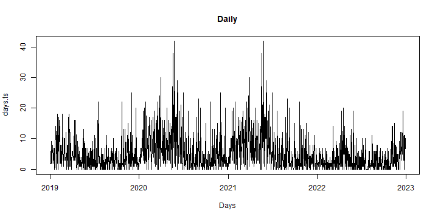
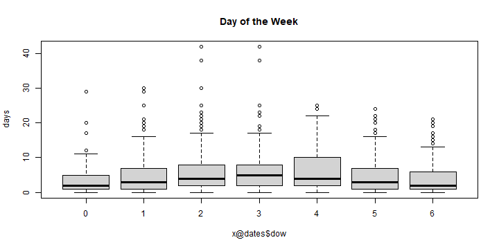
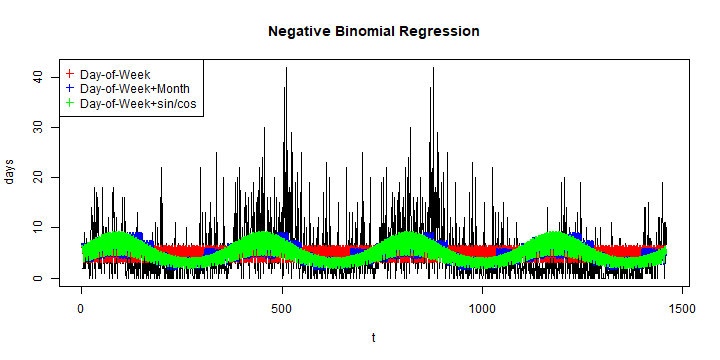
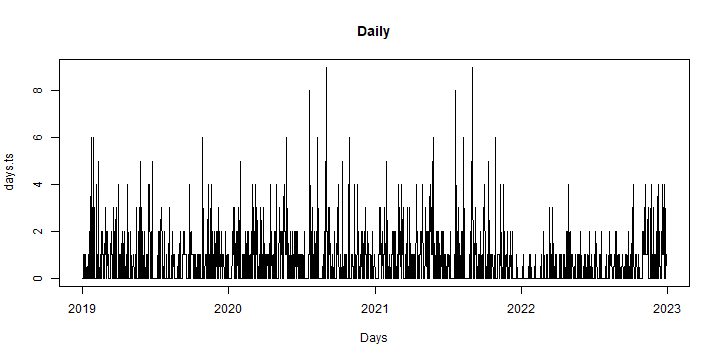
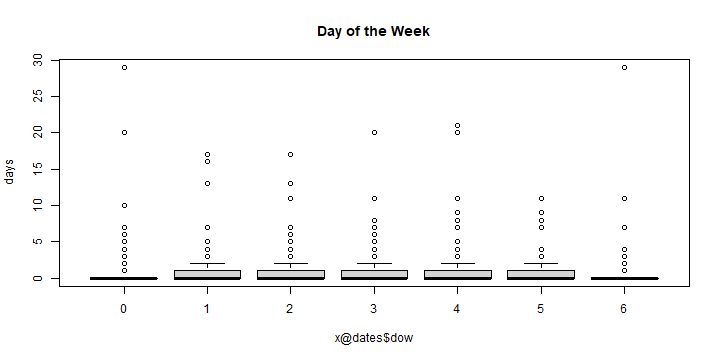
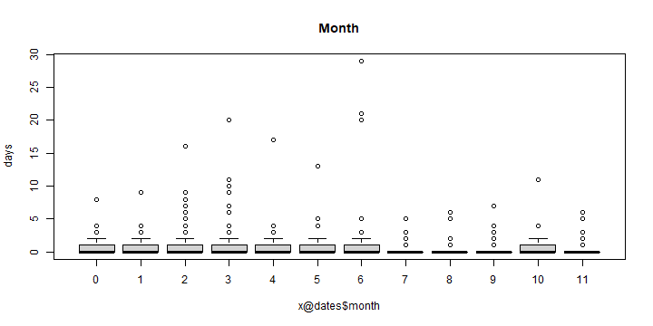
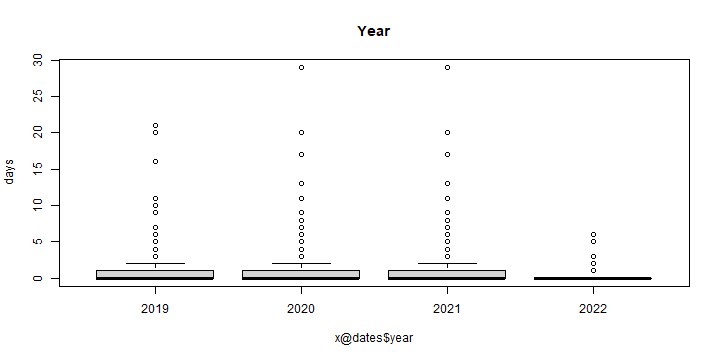

# Retrospective analysis summary for  my.syndromic


```r
#loading and preparing the data to work with
load("my.syndromic.RData")
require(vetsyn)
matrix.days <- x@observed
matrix.week.full <- convert_days_to_week(x@observed,x@dates)
matrix.week <- matrix.week.full[,-(1:2),drop=FALSE]
frequency=365
```

## Cattle

```r
#create time series
s=1
days    <-  matrix.days[,s]
days.ts <-  ts(days, start = c(x@dates$year[1], x@dates$yday[1]),
               frequency = frequency)
t = 1:length(days)

week    <-  matrix.week[,s]
week.ts <-  ts(week, start = c(matrix.week.full[1,2],as.numeric(substr(as.character(matrix.week.full[1,1]),7,8))),
               frequency = 52)
t.week <- 1:length(week)
```


```r
#Plot series
plot(days.ts , xlab="Days", main="Daily")
```



```r
plot(week.ts , xlab="Weeks",main="Weeks")
```


### Summary statistics

```r
#Percentiles
quantile(days,probs=c(0,0.25,0.5,0.75,1),names=FALSE)
```

```
## [1]  0  0  1  5 42
```

```r
round(mean(days),4)
```

```
## [1] 3.339
```

```r
#Number of days at minimum value
(countInMin <- length(which(days == min(days))))
```

```
## [1] 595
```

```r
(percentInMin <- round(((countInMin)/(length(days)))*100,2))
```

```
## [1] 40.75
```


```r
#ACF and PACF
acf(days,main="ACF for daily data")
```


```r
pacf(days,main="PACF for daily data")
```


### Crude (visual) assessment of temporal effects

```r
boxplot(days ~ x@dates$dow, main="Day of the Week")
```



```r
boxplot(days ~ x@dates$month, main = "Month")
```


```r
boxplot(days ~ x@dates$year, main = "Year")
```


### POISSON  Regression with DOW, month or sin/cos wave

```r
distribution="poisson"

month.f = as.factor (x@dates$month)
dow.f <- as.factor (x@dates$dow)
cos = cos (2*pi*t/frequency)
sin = sin (2*pi*t/frequency)
tminus1<-c(days[1],days[1:(length(days)-1)])
tminus2<-c(days[1:2],days[1:(length(days)-2)])
tminus3<-c(days[1:3],days[1:(length(days)-3)])
tminus4<-c(days[1:4],days[1:(length(days)-4)])
tminus5<-c(days[1:5],days[1:(length(days)-5)])
tminus6<-c(days[1:6],days[1:(length(days)-6)])
tminus7<-c(days[1:7],days[1:(length(days)-7)])

fit1 = glm(days~ dow.f, family=distribution)
fit1AR1 = glm(days~ dow.f + tminus1, family=distribution)
fit1AR2 = glm(days~ dow.f + tminus1+ tminus2, family=distribution)
fit1AR3 = glm(days~ dow.f + tminus1+ tminus2 + tminus3, family=distribution)
fit1AR4 = glm(days~ dow.f  +
                tminus1+ tminus2+ tminus3+ tminus4, family=distribution)
fit1AR5 = glm(days~ dow.f  +
                tminus1+ tminus2+ tminus3+ tminus4+ tminus5, family=distribution)
fit1AR6 = glm(days~ dow.f  +
                tminus1+ tminus2+ tminus3+ tminus4+ tminus5 +tminus6, family=distribution)
fit1AR7 = glm(days~ dow.f  +
                tminus1+ tminus2+ tminus3+ tminus4+ tminus5 +tminus6 +tminus7, family=distribution)

fit2 = glm(days~ dow.f+ month.f, family=distribution)
fit2AR1 = glm(days~ dow.f+ month.f + tminus1, family=distribution)
fit2AR2 = glm(days~ dow.f+ month.f + tminus1+ tminus2, family=distribution)
fit2AR3 = glm(days~ dow.f+ month.f + tminus1+ tminus2 + tminus3, family=distribution)
fit2AR4 = glm(days~ dow.f+ month.f +
                tminus1+ tminus2+ tminus3+ tminus4, family=distribution)
fit2AR5 = glm(days~ dow.f+ month.f  +
                tminus1+ tminus2+ tminus3+ tminus4+ tminus5, family=distribution)
fit2AR6 = glm(days~ dow.f+ month.f  +
                tminus1+ tminus2+ tminus3+ tminus4+ tminus5 +tminus6, family=distribution)
fit2AR7 = glm(days~ dow.f+ month.f  +
                tminus1+ tminus2+ tminus3+ tminus4+ tminus5 +tminus6 +tminus7, family=distribution)

fit3 = glm(days~ dow.f+ cos + sin, family=distribution)
fit3AR1 = glm(days~ dow.f+ cos + sin + tminus1, family=distribution)
fit3AR2 = glm(days~ dow.f+ cos + sin + tminus1+ tminus2, family=distribution)
fit3AR3 = glm(days~ dow.f+ cos + sin + tminus1+ tminus2 + tminus3, family=distribution)
fit3AR4 = glm(days~ dow.f  + cos + sin + 
                tminus1+ tminus2+ tminus3+ tminus4, family=distribution)
fit3AR5 = glm(days~ dow.f+ cos + sin  +
                tminus1+ tminus2+ tminus3+ tminus4+ tminus5, family=distribution)
fit3AR6 = glm(days~ dow.f+ cos + sin  +
                tminus1+ tminus2+ tminus3+ tminus4+ tminus5 +tminus6, family=distribution)
fit3AR7 = glm(days~ dow.f+ cos + sin  +
                tminus1+ tminus2+ tminus3+ tminus4+ tminus5 +tminus6 +tminus7, family=distribution)
```


```r
#Printing AICs
AR1 <- c(fit1=fit1$aic,fit1AR1=fit1AR1$aic,fit1AR2=fit1AR2$aic,fit1AR3=fit1AR3$aic,
                          fit1AR4=fit1AR4$aic,fit1AR5=fit1AR5$aic,fit1AR6=fit1AR6$aic,fit1AR7=fit1AR7$aic)
AR2 <- c(fit2=fit2$aic,fit2AR1=fit2AR1$aic,fit2AR2=fit2AR2$aic,fit2AR3=fit2AR3$aic,
                          fit2AR4=fit2AR4$aic,fit2AR5=fit2AR5$aic,fit2AR6=fit2AR6$aic,fit2AR7=fit2AR7$aic)
AR3 <- c(fit3=fit3$aic,fit3AR1=fit3AR1$aic,fit3AR2=fit3AR2$aic,fit3AR3=fit3AR3$aic,
                          fit3AR4=fit3AR4$aic,fit3AR5=fit3AR5$aic,fit3AR6=fit3AR6$aic,fit3AR7=fit3AR7$aic)


print(AR1)
```

```
##      fit1   fit1AR1   fit1AR2   fit1AR3   fit1AR4   fit1AR5   fit1AR6   fit1AR7 
## 10711.497  9811.020  9399.003  8968.264  8719.132  8631.513  8471.082  8224.453
```

```r
print(AR2)
```

```
##      fit2   fit2AR1   fit2AR2   fit2AR3   fit2AR4   fit2AR5   fit2AR6   fit2AR7 
## 10227.869  9565.208  9246.140  8874.165  8655.921  8582.613  8427.220  8177.294
```

```r
print(AR3)
```

```
##      fit3   fit3AR1   fit3AR2   fit3AR3   fit3AR4   fit3AR5   fit3AR6   fit3AR7 
## 10251.540  9576.460  9256.525  8884.964  8666.515  8593.502  8444.304  8203.336
```


```r
plot(t,days, type="l",main="Poisson regression")
lines(fit1$fit, col="red"   , lwd=2)
lines(fit2$fit, col="blue"  , lwd=2)
lines(fit3$fit, col="green" , lwd=2)
legend("topleft",pch=3,col=c("red","blue","green"),
                  c("Day-of-Week", "Day-of-Week+Month","Day-of-Week+sin/cos"))
```


```r
### Negative Binomial Regression with DOW, month or sin/cos wave
```

```r
require(MASS)
```

```
## Loading required package: MASS
```

```
## 
## Attaching package: 'MASS'
```

```
## The following object is masked from 'package:dplyr':
## 
##     select
```

```r
fitNB1 = glm.nb(days~ dow.f)
fitNB1AR1 = glm.nb(days~ dow.f + tminus1)
fitNB1AR2 = glm.nb(days~ dow.f + tminus1+ tminus2)
fitNB1AR3 = glm.nb(days~ dow.f + tminus1+ tminus2 + tminus3)
fitNB1AR4 = glm.nb(days~ dow.f  +
                tminus1+ tminus2+ tminus3+ tminus4)
fitNB1AR5 = glm.nb(days~ dow.f  +
                tminus1+ tminus2+ tminus3+ tminus4+ tminus5)
fitNB1AR6 = glm.nb(days~ dow.f  +
                tminus1+ tminus2+ tminus3+ tminus4+ tminus5 +tminus6)
fitNB1AR7 = glm.nb(days~ dow.f  +
                tminus1+ tminus2+ tminus3+ tminus4+ tminus5 +tminus6 +tminus7)

fitNB2 = glm.nb(days~ dow.f+ month.f)
fitNB2AR1 = glm.nb(days~ dow.f+ month.f + tminus1)
fitNB2AR2 = glm.nb(days~ dow.f+ month.f + tminus1+ tminus2)
fitNB2AR3 = glm.nb(days~ dow.f+ month.f + tminus1+ tminus2 + tminus3)
fitNB2AR4 = glm.nb(days~ dow.f+ month.f +
                tminus1+ tminus2+ tminus3+ tminus4)
fitNB2AR5 = glm.nb(days~ dow.f+ month.f  +
                tminus1+ tminus2+ tminus3+ tminus4+ tminus5)
fitNB2AR6 = glm.nb(days~ dow.f+ month.f  +
                tminus1+ tminus2+ tminus3+ tminus4+ tminus5 +tminus6)
fitNB2AR7 = glm.nb(days~ dow.f+ month.f  +
                tminus1+ tminus2+ tminus3+ tminus4+ tminus5 +tminus6 +tminus7)

fitNB3 = glm.nb(days~ dow.f+ cos + sin)
fitNB3AR1 = glm.nb(days~ dow.f+ cos + sin + tminus1)
fitNB3AR2 = glm.nb(days~ dow.f+ cos + sin + tminus1+ tminus2)
fitNB3AR3 = glm.nb(days~ dow.f+ cos + sin + tminus1+ tminus2 + tminus3)
fitNB3AR4 = glm.nb(days~ dow.f  + cos + sin + 
                tminus1+ tminus2+ tminus3+ tminus4)
fitNB3AR5 = glm.nb(days~ dow.f+ cos + sin  +
                tminus1+ tminus2+ tminus3+ tminus4+ tminus5)
fitNB3AR6 = glm.nb(days~ dow.f+ cos + sin  +
                tminus1+ tminus2+ tminus3+ tminus4+ tminus5 +tminus6)
fitNB3AR7 = glm.nb(days~ dow.f+ cos + sin  +
                tminus1+ tminus2+ tminus3+ tminus4+ tminus5 +tminus6 +tminus7)
```


```r
#Printing AICs
AR_NB1 <- c(fitNB1=fitNB1$aic,fitNB1AR1=fitNB1AR1$aic,fitNB1AR2=fitNB1AR2$aic,fitNB1AR3=fitNB1AR3$aic,
                          fitNB1AR4=fitNB1AR4$aic,fitNB1AR5=fitNB1AR5$aic,fitNB1AR6=fitNB1AR6$aic,fitNB1AR7=fitNB1AR7$aic)
AR_NB2 <- c(fitNB2=fitNB2$aic,fitNB2AR1=fitNB2AR1$aic,fitNB2AR2=fitNB2AR2$aic,fitNB2AR3=fitNB2AR3$aic,
                          fitNB2AR4=fitNB2AR4$aic,fitNB2AR5=fitNB2AR5$aic,fitNB2AR6=fitNB2AR6$aic,fitNB2AR7=fitNB2AR7$aic)
AR_NB3 <- c(fitNB3=fitNB3$aic,fitNB3AR1=fitNB3AR1$aic,fitNB3AR2=fitNB3AR2$aic,fitNB3AR3=fitNB3AR3$aic,
                          fitNB3AR4=fitNB3AR4$aic,fitNB3AR5=fitNB3AR5$aic,fitNB3AR6=fitNB3AR6$aic,fitNB3AR7=fitNB3AR7$aic)
print(AR_NB1)
```

```
##    fitNB1 fitNB1AR1 fitNB1AR2 fitNB1AR3 fitNB1AR4 fitNB1AR5 fitNB1AR6 fitNB1AR7 
##  6535.485  6391.030  6290.070  6199.564  6151.115  6129.692  6087.096  6018.587
```

```r
print(AR_NB2)
```

```
##    fitNB2 fitNB2AR1 fitNB2AR2 fitNB2AR3 fitNB2AR4 fitNB2AR5 fitNB2AR6 fitNB2AR7 
##  6483.538  6379.715  6293.573  6210.419  6164.481  6144.009  6100.453  6028.821
```

```r
print(AR_NB3)
```

```
##    fitNB3 fitNB3AR1 fitNB3AR2 fitNB3AR3 fitNB3AR4 fitNB3AR5 fitNB3AR6 fitNB3AR7 
##  6474.986  6370.325  6284.753  6199.779  6154.353  6133.664  6090.812  6020.038
```


```r
plot(t,days, type="l",main="Negative Binomial Regression")
lines(fitNB1$fit, col="red"   , lwd=2)
lines(fitNB2$fit, col="blue"  , lwd=2)
lines(fitNB3$fit, col="green" , lwd=2)
legend("topleft",pch=3,col=c("red","blue","green"),
                c("Day-of-Week", "Day-of-Week+Month","Day-of-Week+sin/cos"))
```




## Chicken

```r
#create time series
s=2
days    <-  matrix.days[,s]
days.ts <-  ts(days, start = c(x@dates$year[1], x@dates$yday[1]),
               frequency = frequency)
t = 1:length(days)

week    <-  matrix.week[,s]
week.ts <-  ts(week, start = c(matrix.week.full[1,2],as.numeric(substr(as.character(matrix.week.full[1,1]),7,8))),
               frequency = 52)
t.week <- 1:length(week)
```


```r
#Plot series
plot(days.ts , xlab="Days", main="Daily")
```



```r
plot(week.ts , xlab="Weeks",main="Weeks")
```


### Summary statistics

```r
#Percentiles
quantile(days,probs=c(0,0.25,0.5,0.75,1),names=FALSE)
```

```
## [1] 0 0 0 1 9
```

```r
round(mean(days),4)
```

```
## [1] 0.4712
```

```r
#Number of days at minimum value
(countInMin <- length(which(days == min(days))))
```

```
## [1] 1066
```

```r
(percentInMin <- round(((countInMin)/(length(days)))*100,2))
```

```
## [1] 73.01
```


```r
#ACF and PACF
acf(days,main="ACF for daily data")
```


```r
pacf(days,main="PACF for daily data")
```


### Crude (visual) assessment of temporal effects

```r
boxplot(days ~ x@dates$dow, main="Day of the Week")
```


```r
boxplot(days ~ x@dates$month, main = "Month")
```


```r
boxplot(days ~ x@dates$year, main = "Year")
```


### POISSON  Regression with DOW, month or sin/cos wave

```r
distribution="poisson"

month.f = as.factor (x@dates$month)
dow.f <- as.factor (x@dates$dow)
cos = cos (2*pi*t/frequency)
sin = sin (2*pi*t/frequency)
tminus1<-c(days[1],days[1:(length(days)-1)])
tminus2<-c(days[1:2],days[1:(length(days)-2)])
tminus3<-c(days[1:3],days[1:(length(days)-3)])
tminus4<-c(days[1:4],days[1:(length(days)-4)])
tminus5<-c(days[1:5],days[1:(length(days)-5)])
tminus6<-c(days[1:6],days[1:(length(days)-6)])
tminus7<-c(days[1:7],days[1:(length(days)-7)])

fit1 = glm(days~ dow.f, family=distribution)
fit1AR1 = glm(days~ dow.f + tminus1, family=distribution)
fit1AR2 = glm(days~ dow.f + tminus1+ tminus2, family=distribution)
fit1AR3 = glm(days~ dow.f + tminus1+ tminus2 + tminus3, family=distribution)
fit1AR4 = glm(days~ dow.f  +
                tminus1+ tminus2+ tminus3+ tminus4, family=distribution)
fit1AR5 = glm(days~ dow.f  +
                tminus1+ tminus2+ tminus3+ tminus4+ tminus5, family=distribution)
fit1AR6 = glm(days~ dow.f  +
                tminus1+ tminus2+ tminus3+ tminus4+ tminus5 +tminus6, family=distribution)
fit1AR7 = glm(days~ dow.f  +
                tminus1+ tminus2+ tminus3+ tminus4+ tminus5 +tminus6 +tminus7, family=distribution)

fit2 = glm(days~ dow.f+ month.f, family=distribution)
fit2AR1 = glm(days~ dow.f+ month.f + tminus1, family=distribution)
fit2AR2 = glm(days~ dow.f+ month.f + tminus1+ tminus2, family=distribution)
fit2AR3 = glm(days~ dow.f+ month.f + tminus1+ tminus2 + tminus3, family=distribution)
fit2AR4 = glm(days~ dow.f+ month.f +
                tminus1+ tminus2+ tminus3+ tminus4, family=distribution)
fit2AR5 = glm(days~ dow.f+ month.f  +
                tminus1+ tminus2+ tminus3+ tminus4+ tminus5, family=distribution)
fit2AR6 = glm(days~ dow.f+ month.f  +
                tminus1+ tminus2+ tminus3+ tminus4+ tminus5 +tminus6, family=distribution)
fit2AR7 = glm(days~ dow.f+ month.f  +
                tminus1+ tminus2+ tminus3+ tminus4+ tminus5 +tminus6 +tminus7, family=distribution)

fit3 = glm(days~ dow.f+ cos + sin, family=distribution)
fit3AR1 = glm(days~ dow.f+ cos + sin + tminus1, family=distribution)
fit3AR2 = glm(days~ dow.f+ cos + sin + tminus1+ tminus2, family=distribution)
fit3AR3 = glm(days~ dow.f+ cos + sin + tminus1+ tminus2 + tminus3, family=distribution)
fit3AR4 = glm(days~ dow.f  + cos + sin + 
                tminus1+ tminus2+ tminus3+ tminus4, family=distribution)
fit3AR5 = glm(days~ dow.f+ cos + sin  +
                tminus1+ tminus2+ tminus3+ tminus4+ tminus5, family=distribution)
fit3AR6 = glm(days~ dow.f+ cos + sin  +
                tminus1+ tminus2+ tminus3+ tminus4+ tminus5 +tminus6, family=distribution)
fit3AR7 = glm(days~ dow.f+ cos + sin  +
                tminus1+ tminus2+ tminus3+ tminus4+ tminus5 +tminus6 +tminus7, family=distribution)
```


```r
#Printing AICs
AR1 <- c(fit1=fit1$aic,fit1AR1=fit1AR1$aic,fit1AR2=fit1AR2$aic,fit1AR3=fit1AR3$aic,
                          fit1AR4=fit1AR4$aic,fit1AR5=fit1AR5$aic,fit1AR6=fit1AR6$aic,fit1AR7=fit1AR7$aic)
AR2 <- c(fit2=fit2$aic,fit2AR1=fit2AR1$aic,fit2AR2=fit2AR2$aic,fit2AR3=fit2AR3$aic,
                          fit2AR4=fit2AR4$aic,fit2AR5=fit2AR5$aic,fit2AR6=fit2AR6$aic,fit2AR7=fit2AR7$aic)
AR3 <- c(fit3=fit3$aic,fit3AR1=fit3AR1$aic,fit3AR2=fit3AR2$aic,fit3AR3=fit3AR3$aic,
                          fit3AR4=fit3AR4$aic,fit3AR5=fit3AR5$aic,fit3AR6=fit3AR6$aic,fit3AR7=fit3AR7$aic)


print(AR1)
```

```
##     fit1  fit1AR1  fit1AR2  fit1AR3  fit1AR4  fit1AR5  fit1AR6  fit1AR7 
## 2919.531 2845.689 2801.155 2774.695 2769.508 2746.481 2740.154 2707.864
```

```r
print(AR2)
```

```
##     fit2  fit2AR1  fit2AR2  fit2AR3  fit2AR4  fit2AR5  fit2AR6  fit2AR7 
## 2921.611 2853.616 2813.039 2788.692 2784.473 2762.766 2756.790 2724.735
```

```r
print(AR3)
```

```
##     fit3  fit3AR1  fit3AR2  fit3AR3  fit3AR4  fit3AR5  fit3AR6  fit3AR7 
## 2920.739 2847.401 2803.210 2776.826 2771.774 2749.053 2742.878 2710.803
```


```r
plot(t,days, type="l",main="Poisson regression")
lines(fit1$fit, col="red"   , lwd=2)
lines(fit2$fit, col="blue"  , lwd=2)
lines(fit3$fit, col="green" , lwd=2)
legend("topleft",pch=3,col=c("red","blue","green"),
                  c("Day-of-Week", "Day-of-Week+Month","Day-of-Week+sin/cos"))
```


```r
### Negative Binomial Regression with DOW, month or sin/cos wave
```

```r
require(MASS)
fitNB1 = glm.nb(days~ dow.f)
fitNB1AR1 = glm.nb(days~ dow.f + tminus1)
fitNB1AR2 = glm.nb(days~ dow.f + tminus1+ tminus2)
fitNB1AR3 = glm.nb(days~ dow.f + tminus1+ tminus2 + tminus3)
fitNB1AR4 = glm.nb(days~ dow.f  +
                tminus1+ tminus2+ tminus3+ tminus4)
fitNB1AR5 = glm.nb(days~ dow.f  +
                tminus1+ tminus2+ tminus3+ tminus4+ tminus5)
fitNB1AR6 = glm.nb(days~ dow.f  +
                tminus1+ tminus2+ tminus3+ tminus4+ tminus5 +tminus6)
fitNB1AR7 = glm.nb(days~ dow.f  +
                tminus1+ tminus2+ tminus3+ tminus4+ tminus5 +tminus6 +tminus7)

fitNB2 = glm.nb(days~ dow.f+ month.f)
fitNB2AR1 = glm.nb(days~ dow.f+ month.f + tminus1)
fitNB2AR2 = glm.nb(days~ dow.f+ month.f + tminus1+ tminus2)
fitNB2AR3 = glm.nb(days~ dow.f+ month.f + tminus1+ tminus2 + tminus3)
fitNB2AR4 = glm.nb(days~ dow.f+ month.f +
                tminus1+ tminus2+ tminus3+ tminus4)
fitNB2AR5 = glm.nb(days~ dow.f+ month.f  +
                tminus1+ tminus2+ tminus3+ tminus4+ tminus5)
fitNB2AR6 = glm.nb(days~ dow.f+ month.f  +
                tminus1+ tminus2+ tminus3+ tminus4+ tminus5 +tminus6)
fitNB2AR7 = glm.nb(days~ dow.f+ month.f  +
                tminus1+ tminus2+ tminus3+ tminus4+ tminus5 +tminus6 +tminus7)

fitNB3 = glm.nb(days~ dow.f+ cos + sin)
fitNB3AR1 = glm.nb(days~ dow.f+ cos + sin + tminus1)
fitNB3AR2 = glm.nb(days~ dow.f+ cos + sin + tminus1+ tminus2)
fitNB3AR3 = glm.nb(days~ dow.f+ cos + sin + tminus1+ tminus2 + tminus3)
fitNB3AR4 = glm.nb(days~ dow.f  + cos + sin + 
                tminus1+ tminus2+ tminus3+ tminus4)
fitNB3AR5 = glm.nb(days~ dow.f+ cos + sin  +
                tminus1+ tminus2+ tminus3+ tminus4+ tminus5)
fitNB3AR6 = glm.nb(days~ dow.f+ cos + sin  +
                tminus1+ tminus2+ tminus3+ tminus4+ tminus5 +tminus6)
fitNB3AR7 = glm.nb(days~ dow.f+ cos + sin  +
                tminus1+ tminus2+ tminus3+ tminus4+ tminus5 +tminus6 +tminus7)
```


```r
#Printing AICs
AR_NB1 <- c(fitNB1=fitNB1$aic,fitNB1AR1=fitNB1AR1$aic,fitNB1AR2=fitNB1AR2$aic,fitNB1AR3=fitNB1AR3$aic,
                          fitNB1AR4=fitNB1AR4$aic,fitNB1AR5=fitNB1AR5$aic,fitNB1AR6=fitNB1AR6$aic,fitNB1AR7=fitNB1AR7$aic)
AR_NB2 <- c(fitNB2=fitNB2$aic,fitNB2AR1=fitNB2AR1$aic,fitNB2AR2=fitNB2AR2$aic,fitNB2AR3=fitNB2AR3$aic,
                          fitNB2AR4=fitNB2AR4$aic,fitNB2AR5=fitNB2AR5$aic,fitNB2AR6=fitNB2AR6$aic,fitNB2AR7=fitNB2AR7$aic)
AR_NB3 <- c(fitNB3=fitNB3$aic,fitNB3AR1=fitNB3AR1$aic,fitNB3AR2=fitNB3AR2$aic,fitNB3AR3=fitNB3AR3$aic,
                          fitNB3AR4=fitNB3AR4$aic,fitNB3AR5=fitNB3AR5$aic,fitNB3AR6=fitNB3AR6$aic,fitNB3AR7=fitNB3AR7$aic)
print(AR_NB1)
```

```
##    fitNB1 fitNB1AR1 fitNB1AR2 fitNB1AR3 fitNB1AR4 fitNB1AR5 fitNB1AR6 fitNB1AR7 
##  2621.849  2583.187  2555.907  2543.782  2541.921  2530.485  2523.756  2508.671
```

```r
print(AR_NB2)
```

```
##    fitNB2 fitNB2AR1 fitNB2AR2 fitNB2AR3 fitNB2AR4 fitNB2AR5 fitNB2AR6 fitNB2AR7 
##  2633.420  2598.958  2573.081  2561.702  2560.381  2549.359  2543.095  2527.762
```

```r
print(AR_NB3)
```

```
##    fitNB3 fitNB3AR1 fitNB3AR2 fitNB3AR3 fitNB3AR4 fitNB3AR5 fitNB3AR6 fitNB3AR7 
##  2623.992  2585.346  2558.177  2546.218  2544.370  2533.458  2527.034  2511.844
```


```r
plot(t,days, type="l",main="Negative Binomial Regression")
lines(fitNB1$fit, col="red"   , lwd=2)
lines(fitNB2$fit, col="blue"  , lwd=2)
lines(fitNB3$fit, col="green" , lwd=2)
legend("topleft",pch=3,col=c("red","blue","green"),
                c("Day-of-Week", "Day-of-Week+Month","Day-of-Week+sin/cos"))
```


## Swine

```r
#create time series
s=3
days    <-  matrix.days[,s]
days.ts <-  ts(days, start = c(x@dates$year[1], x@dates$yday[1]),
               frequency = frequency)
t = 1:length(days)

week    <-  matrix.week[,s]
week.ts <-  ts(week, start = c(matrix.week.full[1,2],as.numeric(substr(as.character(matrix.week.full[1,1]),7,8))),
               frequency = 52)
t.week <- 1:length(week)
```


```r
#Plot series
plot(days.ts , xlab="Days", main="Daily")
```


```r
plot(week.ts , xlab="Weeks",main="Weeks")
```


### Summary statistics

```r
#Percentiles
quantile(days,probs=c(0,0.25,0.5,0.75,1),names=FALSE)
```

```
## [1]  0  0  0  0 29
```

```r
round(mean(days),4)
```

```
## [1] 0.5075
```

```r
#Number of days at minimum value
(countInMin <- length(which(days == min(days))))
```

```
## [1] 1171
```

```r
(percentInMin <- round(((countInMin)/(length(days)))*100,2))
```

```
## [1] 80.21
```


```r
#ACF and PACF
acf(days,main="ACF for daily data")
```


```r
pacf(days,main="PACF for daily data")
```


### Crude (visual) assessment of temporal effects

```r
boxplot(days ~ x@dates$dow, main="Day of the Week")
```



```r
boxplot(days ~ x@dates$month, main = "Month")
```



```r
boxplot(days ~ x@dates$year, main = "Year")
```



### POISSON  Regression with DOW, month or sin/cos wave

```r
distribution="poisson"

month.f = as.factor (x@dates$month)
dow.f <- as.factor (x@dates$dow)
cos = cos (2*pi*t/frequency)
sin = sin (2*pi*t/frequency)
tminus1<-c(days[1],days[1:(length(days)-1)])
tminus2<-c(days[1:2],days[1:(length(days)-2)])
tminus3<-c(days[1:3],days[1:(length(days)-3)])
tminus4<-c(days[1:4],days[1:(length(days)-4)])
tminus5<-c(days[1:5],days[1:(length(days)-5)])
tminus6<-c(days[1:6],days[1:(length(days)-6)])
tminus7<-c(days[1:7],days[1:(length(days)-7)])

fit1 = glm(days~ dow.f, family=distribution)
fit1AR1 = glm(days~ dow.f + tminus1, family=distribution)
fit1AR2 = glm(days~ dow.f + tminus1+ tminus2, family=distribution)
fit1AR3 = glm(days~ dow.f + tminus1+ tminus2 + tminus3, family=distribution)
fit1AR4 = glm(days~ dow.f  +
                tminus1+ tminus2+ tminus3+ tminus4, family=distribution)
fit1AR5 = glm(days~ dow.f  +
                tminus1+ tminus2+ tminus3+ tminus4+ tminus5, family=distribution)
fit1AR6 = glm(days~ dow.f  +
                tminus1+ tminus2+ tminus3+ tminus4+ tminus5 +tminus6, family=distribution)
fit1AR7 = glm(days~ dow.f  +
                tminus1+ tminus2+ tminus3+ tminus4+ tminus5 +tminus6 +tminus7, family=distribution)

fit2 = glm(days~ dow.f+ month.f, family=distribution)
fit2AR1 = glm(days~ dow.f+ month.f + tminus1, family=distribution)
fit2AR2 = glm(days~ dow.f+ month.f + tminus1+ tminus2, family=distribution)
fit2AR3 = glm(days~ dow.f+ month.f + tminus1+ tminus2 + tminus3, family=distribution)
fit2AR4 = glm(days~ dow.f+ month.f +
                tminus1+ tminus2+ tminus3+ tminus4, family=distribution)
fit2AR5 = glm(days~ dow.f+ month.f  +
                tminus1+ tminus2+ tminus3+ tminus4+ tminus5, family=distribution)
fit2AR6 = glm(days~ dow.f+ month.f  +
                tminus1+ tminus2+ tminus3+ tminus4+ tminus5 +tminus6, family=distribution)
fit2AR7 = glm(days~ dow.f+ month.f  +
                tminus1+ tminus2+ tminus3+ tminus4+ tminus5 +tminus6 +tminus7, family=distribution)

fit3 = glm(days~ dow.f+ cos + sin, family=distribution)
fit3AR1 = glm(days~ dow.f+ cos + sin + tminus1, family=distribution)
fit3AR2 = glm(days~ dow.f+ cos + sin + tminus1+ tminus2, family=distribution)
fit3AR3 = glm(days~ dow.f+ cos + sin + tminus1+ tminus2 + tminus3, family=distribution)
fit3AR4 = glm(days~ dow.f  + cos + sin + 
                tminus1+ tminus2+ tminus3+ tminus4, family=distribution)
fit3AR5 = glm(days~ dow.f+ cos + sin  +
                tminus1+ tminus2+ tminus3+ tminus4+ tminus5, family=distribution)
fit3AR6 = glm(days~ dow.f+ cos + sin  +
                tminus1+ tminus2+ tminus3+ tminus4+ tminus5 +tminus6, family=distribution)
fit3AR7 = glm(days~ dow.f+ cos + sin  +
                tminus1+ tminus2+ tminus3+ tminus4+ tminus5 +tminus6 +tminus7, family=distribution)
```


```r
#Printing AICs
AR1 <- c(fit1=fit1$aic,fit1AR1=fit1AR1$aic,fit1AR2=fit1AR2$aic,fit1AR3=fit1AR3$aic,
                          fit1AR4=fit1AR4$aic,fit1AR5=fit1AR5$aic,fit1AR6=fit1AR6$aic,fit1AR7=fit1AR7$aic)
AR2 <- c(fit2=fit2$aic,fit2AR1=fit2AR1$aic,fit2AR2=fit2AR2$aic,fit2AR3=fit2AR3$aic,
                          fit2AR4=fit2AR4$aic,fit2AR5=fit2AR5$aic,fit2AR6=fit2AR6$aic,fit2AR7=fit2AR7$aic)
AR3 <- c(fit3=fit3$aic,fit3AR1=fit3AR1$aic,fit3AR2=fit3AR2$aic,fit3AR3=fit3AR3$aic,
                          fit3AR4=fit3AR4$aic,fit3AR5=fit3AR5$aic,fit3AR6=fit3AR6$aic,fit3AR7=fit3AR7$aic)


print(AR1)
```

```
##     fit1  fit1AR1  fit1AR2  fit1AR3  fit1AR4  fit1AR5  fit1AR6  fit1AR7 
## 3750.406 3708.860 3684.855 3531.450 3507.234 3444.469 3446.279 3427.234
```

```r
print(AR2)
```

```
##     fit2  fit2AR1  fit2AR2  fit2AR3  fit2AR4  fit2AR5  fit2AR6  fit2AR7 
## 3611.270 3590.330 3579.551 3464.370 3449.436 3399.088 3401.088 3388.322
```

```r
print(AR3)
```

```
##     fit3  fit3AR1  fit3AR2  fit3AR3  fit3AR4  fit3AR5  fit3AR6  fit3AR7 
## 3662.426 3632.271 3615.962 3481.931 3460.316 3400.683 3402.422 3388.344
```


```r
plot(t,days, type="l",main="Poisson regression")
lines(fit1$fit, col="red"   , lwd=2)
lines(fit2$fit, col="blue"  , lwd=2)
lines(fit3$fit, col="green" , lwd=2)
legend("topleft",pch=3,col=c("red","blue","green"),
                  c("Day-of-Week", "Day-of-Week+Month","Day-of-Week+sin/cos"))
```


```r
### Negative Binomial Regression with DOW, month or sin/cos wave
```

```r
require(MASS)
fitNB1 = glm.nb(days~ dow.f)
fitNB1AR1 = glm.nb(days~ dow.f + tminus1)
fitNB1AR2 = glm.nb(days~ dow.f + tminus1+ tminus2)
fitNB1AR3 = glm.nb(days~ dow.f + tminus1+ tminus2 + tminus3)
fitNB1AR4 = glm.nb(days~ dow.f  +
                tminus1+ tminus2+ tminus3+ tminus4)
fitNB1AR5 = glm.nb(days~ dow.f  +
                tminus1+ tminus2+ tminus3+ tminus4+ tminus5)
fitNB1AR6 = glm.nb(days~ dow.f  +
                tminus1+ tminus2+ tminus3+ tminus4+ tminus5 +tminus6)
fitNB1AR7 = glm.nb(days~ dow.f  +
                tminus1+ tminus2+ tminus3+ tminus4+ tminus5 +tminus6 +tminus7)

fitNB2 = glm.nb(days~ dow.f+ month.f)
fitNB2AR1 = glm.nb(days~ dow.f+ month.f + tminus1)
fitNB2AR2 = glm.nb(days~ dow.f+ month.f + tminus1+ tminus2)
fitNB2AR3 = glm.nb(days~ dow.f+ month.f + tminus1+ tminus2 + tminus3)
fitNB2AR4 = glm.nb(days~ dow.f+ month.f +
                tminus1+ tminus2+ tminus3+ tminus4)
fitNB2AR5 = glm.nb(days~ dow.f+ month.f  +
                tminus1+ tminus2+ tminus3+ tminus4+ tminus5)
fitNB2AR6 = glm.nb(days~ dow.f+ month.f  +
                tminus1+ tminus2+ tminus3+ tminus4+ tminus5 +tminus6)
fitNB2AR7 = glm.nb(days~ dow.f+ month.f  +
                tminus1+ tminus2+ tminus3+ tminus4+ tminus5 +tminus6 +tminus7)

fitNB3 = glm.nb(days~ dow.f+ cos + sin)
fitNB3AR1 = glm.nb(days~ dow.f+ cos + sin + tminus1)
fitNB3AR2 = glm.nb(days~ dow.f+ cos + sin + tminus1+ tminus2)
fitNB3AR3 = glm.nb(days~ dow.f+ cos + sin + tminus1+ tminus2 + tminus3)
fitNB3AR4 = glm.nb(days~ dow.f  + cos + sin + 
                tminus1+ tminus2+ tminus3+ tminus4)
fitNB3AR5 = glm.nb(days~ dow.f+ cos + sin  +
                tminus1+ tminus2+ tminus3+ tminus4+ tminus5)
fitNB3AR6 = glm.nb(days~ dow.f+ cos + sin  +
                tminus1+ tminus2+ tminus3+ tminus4+ tminus5 +tminus6)
fitNB3AR7 = glm.nb(days~ dow.f+ cos + sin  +
                tminus1+ tminus2+ tminus3+ tminus4+ tminus5 +tminus6 +tminus7)
```


```r
#Printing AICs
AR_NB1 <- c(fitNB1=fitNB1$aic,fitNB1AR1=fitNB1AR1$aic,fitNB1AR2=fitNB1AR2$aic,fitNB1AR3=fitNB1AR3$aic,
                          fitNB1AR4=fitNB1AR4$aic,fitNB1AR5=fitNB1AR5$aic,fitNB1AR6=fitNB1AR6$aic,fitNB1AR7=fitNB1AR7$aic)
AR_NB2 <- c(fitNB2=fitNB2$aic,fitNB2AR1=fitNB2AR1$aic,fitNB2AR2=fitNB2AR2$aic,fitNB2AR3=fitNB2AR3$aic,
                          fitNB2AR4=fitNB2AR4$aic,fitNB2AR5=fitNB2AR5$aic,fitNB2AR6=fitNB2AR6$aic,fitNB2AR7=fitNB2AR7$aic)
AR_NB3 <- c(fitNB3=fitNB3$aic,fitNB3AR1=fitNB3AR1$aic,fitNB3AR2=fitNB3AR2$aic,fitNB3AR3=fitNB3AR3$aic,
                          fitNB3AR4=fitNB3AR4$aic,fitNB3AR5=fitNB3AR5$aic,fitNB3AR6=fitNB3AR6$aic,fitNB3AR7=fitNB3AR7$aic)
print(AR_NB1)
```

```
##    fitNB1 fitNB1AR1 fitNB1AR2 fitNB1AR3 fitNB1AR4 fitNB1AR5 fitNB1AR6 fitNB1AR7 
##  2398.196  2389.174  2377.766  2335.254  2327.373  2297.630  2288.121  2287.255
```

```r
print(AR_NB2)
```

```
##    fitNB2 fitNB2AR1 fitNB2AR2 fitNB2AR3 fitNB2AR4 fitNB2AR5 fitNB2AR6 fitNB2AR7 
##  2382.775  2379.810  2373.312  2343.936  2339.419  2314.843  2306.138  2305.348
```

```r
print(AR_NB3)
```

```
##    fitNB3 fitNB3AR1 fitNB3AR2 fitNB3AR3 fitNB3AR4 fitNB3AR5 fitNB3AR6 fitNB3AR7 
##  2381.138  2375.466  2367.582  2328.636  2323.821  2298.823  2289.566  2289.047
```


```r
plot(t,days, type="l",main="Negative Binomial Regression")
lines(fitNB1$fit, col="red"   , lwd=2)
lines(fitNB2$fit, col="blue"  , lwd=2)
lines(fitNB3$fit, col="green" , lwd=2)
legend("topleft",pch=3,col=c("red","blue","green"),
                c("Day-of-Week", "Day-of-Week+Month","Day-of-Week+sin/cos"))
```


