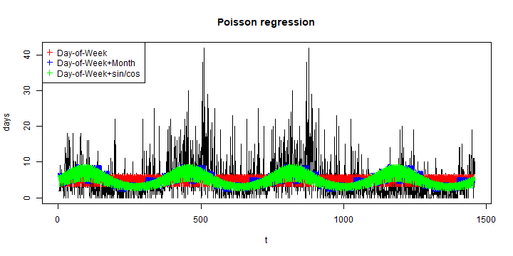
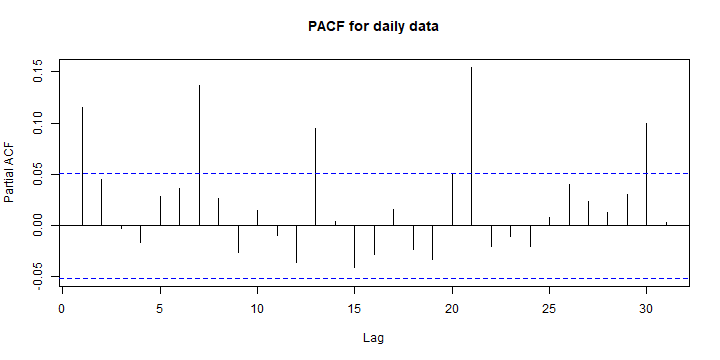
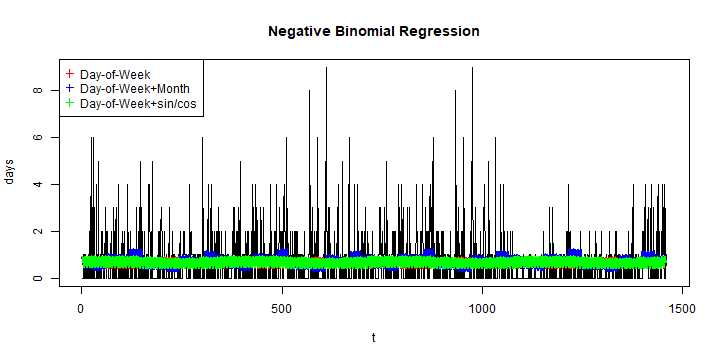

# Retrospective analysis summary for  my.syndromic


```r
#loading and preparing the data to work with
load("my.syndromic.RData")
require(vetsyn)
matrix.week <- x@observed
frequency=52
```

## Chicken

```r
#create time series
s=1
week    <-  matrix.week[,s]
week.ts <-  ts(week, start = c(x@dates$year[1], x@dates$week[1]),
               frequency = frequency)
t = 1:length(week)
```


```r
#Plot series
plot(week.ts , xlab="Weeks",main="Weeks")
```


### Summary statistics

```r
#Percentiles
quantile(week,probs=c(0,0.25,0.5,0.75,1),names=FALSE)
```

```
## [1]  0  2  4  7 17
```

```r
round(mean(week),4)
```

```
## [1] 4.9282
```

```r
#Number of weeks at minimum value
(countInMin <- length(which(week == min(week))))
```

```
## [1] 10
```

```r
(percentInMin <- round(((countInMin)/(length(week)))*100,2))
```

```
## [1] 4.78
```


```r
#ACF and PACF
acf(week,main="ACF for weekly data",lag.max=(frequency+5))
```


```r
pacf(week,main="PACF for weekly data",lag.max=(frequency+5))
```


### Crude (visual) assessment of temporal effects

```r
boxplot(week ~ x@dates$week, main="Week of the year")
```


```r
boxplot(week ~ x@dates$year, main = "Year")
```


### POISSON  Regression with sin/cos wave

```r
distribution="poisson"

cos = cos (2*pi*t/frequency)
sin = sin (2*pi*t/frequency)
year.f <- as.factor (x@dates$year)
tminus1<-c(week[1],week[1:(length(week)-1)])
tminus2<-c(week[1:2],week[1:(length(week)-2)])
tminus3<-c(week[1:3],week[1:(length(week)-3)])
tminus4<-c(week[1:4],week[1:(length(week)-4)])

fit1 = glm(week ~ year.f, family=distribution)
fit1AR1 = glm(week~ year.f + tminus1, family=distribution)
fit1AR2 = glm(week~ year.f + tminus1+ tminus2, family=distribution)
fit1AR3 = glm(week~ year.f + tminus1+ tminus2 + tminus3, family=distribution)
fit1AR4 = glm(week~ year.f  +
                tminus1+ tminus2+ tminus3+ tminus4, family=distribution)

fit2 = glm(week ~ sin + cos, family=distribution)
fit2AR1 = glm(week~ sin + cos + tminus1, family=distribution)
fit2AR2 = glm(week~ sin + cos + tminus1+ tminus2, family=distribution)
fit2AR3 = glm(week~ sin + cos + tminus1+ tminus2 + tminus3, family=distribution)
fit2AR4 = glm(week~ sin + cos  +
                tminus1+ tminus2+ tminus3+ tminus4, family=distribution)

fit3 = glm(week ~ t + sin + cos, family=distribution)
fit3AR1 = glm(week~ t + sin + cos + tminus1, family=distribution)
fit3AR2 = glm(week~ t + sin + cos + tminus1+ tminus2, family=distribution)
fit3AR3 = glm(week~ t + sin + cos + tminus1+ tminus2 + tminus3, family=distribution)
fit3AR4 = glm(week~ t + sin + cos  +
                tminus1+ tminus2+ tminus3+ tminus4, family=distribution)
```


```r
#Printing AICs
AR1 <- c(fit1=fit1$aic,fit1AR1=fit1AR1$aic,fit1AR2=fit1AR2$aic,fit1AR3=fit1AR3$aic,
                          fit1AR4=fit1AR4$aic)
AR2 <- c(fit2=fit2$aic,fit2AR1=fit2AR1$aic,fit2AR2=fit2AR2$aic,fit2AR3=fit2AR3$aic,
                          fit2AR4=fit2AR4$aic)
AR3 <- c(fit3=fit3$aic,fit3AR1=fit3AR1$aic,fit3AR2=fit3AR2$aic,fit3AR3=fit3AR3$aic,
                          fit3AR4=fit3AR4$aic)


print(AR1)
```

```
##     fit1  fit1AR1  fit1AR2  fit1AR3  fit1AR4 
## 1166.581 1160.287 1161.387 1161.442 1154.849
```

```r
print(AR2)
```

```
##     fit2  fit2AR1  fit2AR2  fit2AR3  fit2AR4 
## 1204.344 1186.266 1188.079 1182.184 1166.380
```

```r
print(AR3)
```

```
##     fit3  fit3AR1  fit3AR2  fit3AR3  fit3AR4 
## 1196.681 1181.500 1183.478 1178.762 1164.957
```


```r
plot(t,week, type="l",main="Poisson regression")
lines(fit1$fit, col="red"   , lwd=2)
lines(fit2$fit, col="blue"  , lwd=2)
lines(fit3$fit, col="green" , lwd=2)
legend("topleft",pch=3,col=c("red","blue","green"),
                  c("year", "sin/cos","t + sin/cos"))
```



```r
### Negative Binomial Regression with sin/cos wave
```

```r
require(MASS)
```

```
## Loading required package: MASS
```

```
## 
## Attaching package: 'MASS'
```

```
## The following object is masked from 'package:dplyr':
## 
##     select
```

```r
fitNB1 = glm.nb(week ~ year.f)
fitNB1AR1 = glm.nb(week~ year.f + tminus1)
fitNB1AR2 = glm.nb(week~ year.f + tminus1+ tminus2)
fitNB1AR3 = glm.nb(week~ year.f + tminus1+ tminus2 + tminus3)
fitNB1AR4 = glm.nb(week~ year.f  +
                tminus1+ tminus2+ tminus3+ tminus4)

fitNB2 = glm.nb(week ~ sin + cos)
fitNB2AR1 = glm.nb(week~ sin + cos + tminus1)
fitNB2AR2 = glm.nb(week~ sin + cos + tminus1+ tminus2)
fitNB2AR3 = glm.nb(week~ sin + cos + tminus1+ tminus2 + tminus3)
fitNB2AR4 = glm.nb(week~ sin + cos  +
                tminus1+ tminus2+ tminus3+ tminus4)

fitNB3 = glm.nb(week ~ t + sin + cos)
fitNB3AR1 = glm.nb(week~ t + sin + cos + tminus1)
fitNB3AR2 = glm.nb(week~ t + sin + cos + tminus1+ tminus2)
fitNB3AR3 = glm.nb(week~ t + sin + cos + tminus1+ tminus2 + tminus3)
fitNB3AR4 = glm.nb(week~ t + sin + cos  +
                tminus1+ tminus2+ tminus3+ tminus4)
```


```r
#Printing AICs
AR_NB1 <- c(fitNB1=fitNB1$aic,fitNB1AR1=fitNB1AR1$aic,fitNB1AR2=fitNB1AR2$aic,fitNB1AR3=fitNB1AR3$aic,
                          fitNB1AR4=fitNB1AR4$aic)
AR_NB2 <- c(fitNB2=fitNB2$aic,fitNB2AR1=fitNB2AR1$aic,fitNB2AR2=fitNB2AR2$aic,fitNB2AR3=fitNB2AR3$aic,
                          fitNB2AR4=fitNB2AR4$aic)
AR_NB3 <- c(fitNB3=fitNB3$aic,fitNB3AR1=fitNB3AR1$aic,fitNB3AR2=fitNB3AR2$aic,fitNB3AR3=fitNB3AR3$aic,
                          fitNB3AR4=fitNB3AR4$aic)
print(AR_NB1)
```

```
##    fitNB1 fitNB1AR1 fitNB1AR2 fitNB1AR3 fitNB1AR4 
##  1065.468  1063.188  1065.061  1066.177  1063.779
```

```r
print(AR_NB2)
```

```
##    fitNB2 fitNB2AR1 fitNB2AR2 fitNB2AR3 fitNB2AR4 
##  1079.782  1074.187  1076.056  1074.722  1068.976
```

```r
print(AR_NB3)
```

```
##    fitNB3 fitNB3AR1 fitNB3AR2 fitNB3AR3 fitNB3AR4 
##  1077.959  1072.951  1074.881  1073.951  1069.087
```


```r
plot(t,week, type="l",main="Negative Binomial Regression")
lines(fitNB1$fit, col="red"   , lwd=2)
lines(fitNB2$fit, col="blue"  , lwd=2)
lines(fitNB3$fit, col="green" , lwd=2)
legend("topleft",pch=3,col=c("red","blue","green"),
                  c("year", "sin/cos","t + sin/cos"))
```


## Swine

```r
#create time series
s=2
week    <-  matrix.week[,s]
week.ts <-  ts(week, start = c(x@dates$year[1], x@dates$week[1]),
               frequency = frequency)
t = 1:length(week)
```


```r
#Plot series
plot(week.ts , xlab="Weeks",main="Weeks")
```


### Summary statistics

```r
#Percentiles
quantile(week,probs=c(0,0.25,0.5,0.75,1),names=FALSE)
```

```
## [1]  0  1  3  6 52
```

```r
round(mean(week),4)
```

```
## [1] 5.2919
```

```r
#Number of weeks at minimum value
(countInMin <- length(which(week == min(week))))
```

```
## [1] 31
```

```r
(percentInMin <- round(((countInMin)/(length(week)))*100,2))
```

```
## [1] 14.83
```


```r
#ACF and PACF
acf(week,main="ACF for weekly data",lag.max=(frequency+5))
```


```r
pacf(week,main="PACF for weekly data",lag.max=(frequency+5))
```



### Crude (visual) assessment of temporal effects

```r
boxplot(week ~ x@dates$week, main="Week of the year")
```


```r
boxplot(week ~ x@dates$year, main = "Year")
```


### POISSON  Regression with sin/cos wave

```r
distribution="poisson"

cos = cos (2*pi*t/frequency)
sin = sin (2*pi*t/frequency)
year.f <- as.factor (x@dates$year)
tminus1<-c(week[1],week[1:(length(week)-1)])
tminus2<-c(week[1:2],week[1:(length(week)-2)])
tminus3<-c(week[1:3],week[1:(length(week)-3)])
tminus4<-c(week[1:4],week[1:(length(week)-4)])

fit1 = glm(week ~ year.f, family=distribution)
fit1AR1 = glm(week~ year.f + tminus1, family=distribution)
fit1AR2 = glm(week~ year.f + tminus1+ tminus2, family=distribution)
fit1AR3 = glm(week~ year.f + tminus1+ tminus2 + tminus3, family=distribution)
fit1AR4 = glm(week~ year.f  +
                tminus1+ tminus2+ tminus3+ tminus4, family=distribution)

fit2 = glm(week ~ sin + cos, family=distribution)
fit2AR1 = glm(week~ sin + cos + tminus1, family=distribution)
fit2AR2 = glm(week~ sin + cos + tminus1+ tminus2, family=distribution)
fit2AR3 = glm(week~ sin + cos + tminus1+ tminus2 + tminus3, family=distribution)
fit2AR4 = glm(week~ sin + cos  +
                tminus1+ tminus2+ tminus3+ tminus4, family=distribution)

fit3 = glm(week ~ t + sin + cos, family=distribution)
fit3AR1 = glm(week~ t + sin + cos + tminus1, family=distribution)
fit3AR2 = glm(week~ t + sin + cos + tminus1+ tminus2, family=distribution)
fit3AR3 = glm(week~ t + sin + cos + tminus1+ tminus2 + tminus3, family=distribution)
fit3AR4 = glm(week~ t + sin + cos  +
                tminus1+ tminus2+ tminus3+ tminus4, family=distribution)
```


```r
#Printing AICs
AR1 <- c(fit1=fit1$aic,fit1AR1=fit1AR1$aic,fit1AR2=fit1AR2$aic,fit1AR3=fit1AR3$aic,
                          fit1AR4=fit1AR4$aic)
AR2 <- c(fit2=fit2$aic,fit2AR1=fit2AR1$aic,fit2AR2=fit2AR2$aic,fit2AR3=fit2AR3$aic,
                          fit2AR4=fit2AR4$aic)
AR3 <- c(fit3=fit3$aic,fit3AR1=fit3AR1$aic,fit3AR2=fit3AR2$aic,fit3AR3=fit3AR3$aic,
                          fit3AR4=fit3AR4$aic)


print(AR1)
```

```
##     fit1  fit1AR1  fit1AR2  fit1AR3  fit1AR4 
## 1821.148 1786.125 1780.074 1775.909 1777.848
```

```r
print(AR2)
```

```
##     fit2  fit2AR1  fit2AR2  fit2AR3  fit2AR4 
## 1886.030 1839.827 1829.164 1820.560 1822.195
```

```r
print(AR3)
```

```
##     fit3  fit3AR1  fit3AR2  fit3AR3  fit3AR4 
## 1803.716 1779.999 1778.357 1776.959 1778.491
```


```r
plot(t,week, type="l",main="Poisson regression")
lines(fit1$fit, col="red"   , lwd=2)
lines(fit2$fit, col="blue"  , lwd=2)
lines(fit3$fit, col="green" , lwd=2)
legend("topleft",pch=3,col=c("red","blue","green"),
                  c("year", "sin/cos","t + sin/cos"))
```


```r
### Negative Binomial Regression with sin/cos wave
```

```r
require(MASS)
fitNB1 = glm.nb(week ~ year.f)
fitNB1AR1 = glm.nb(week~ year.f + tminus1)
fitNB1AR2 = glm.nb(week~ year.f + tminus1+ tminus2)
fitNB1AR3 = glm.nb(week~ year.f + tminus1+ tminus2 + tminus3)
fitNB1AR4 = glm.nb(week~ year.f  +
                tminus1+ tminus2+ tminus3+ tminus4)

fitNB2 = glm.nb(week ~ sin + cos)
fitNB2AR1 = glm.nb(week~ sin + cos + tminus1)
fitNB2AR2 = glm.nb(week~ sin + cos + tminus1+ tminus2)
fitNB2AR3 = glm.nb(week~ sin + cos + tminus1+ tminus2 + tminus3)
fitNB2AR4 = glm.nb(week~ sin + cos  +
                tminus1+ tminus2+ tminus3+ tminus4)

fitNB3 = glm.nb(week ~ t + sin + cos)
fitNB3AR1 = glm.nb(week~ t + sin + cos + tminus1)
fitNB3AR2 = glm.nb(week~ t + sin + cos + tminus1+ tminus2)
fitNB3AR3 = glm.nb(week~ t + sin + cos + tminus1+ tminus2 + tminus3)
fitNB3AR4 = glm.nb(week~ t + sin + cos  +
                tminus1+ tminus2+ tminus3+ tminus4)
```


```r
#Printing AICs
AR_NB1 <- c(fitNB1=fitNB1$aic,fitNB1AR1=fitNB1AR1$aic,fitNB1AR2=fitNB1AR2$aic,fitNB1AR3=fitNB1AR3$aic,
                          fitNB1AR4=fitNB1AR4$aic)
AR_NB2 <- c(fitNB2=fitNB2$aic,fitNB2AR1=fitNB2AR1$aic,fitNB2AR2=fitNB2AR2$aic,fitNB2AR3=fitNB2AR3$aic,
                          fitNB2AR4=fitNB2AR4$aic)
AR_NB3 <- c(fitNB3=fitNB3$aic,fitNB3AR1=fitNB3AR1$aic,fitNB3AR2=fitNB3AR2$aic,fitNB3AR3=fitNB3AR3$aic,
                          fitNB3AR4=fitNB3AR4$aic)
print(AR_NB1)
```

```
##    fitNB1 fitNB1AR1 fitNB1AR2 fitNB1AR3 fitNB1AR4 
##  1130.608  1124.465  1125.728  1126.909  1128.785
```

```r
print(AR_NB2)
```

```
##    fitNB2 fitNB2AR1 fitNB2AR2 fitNB2AR3 fitNB2AR4 
##  1144.498  1138.383  1139.634  1139.829  1140.937
```

```r
print(AR_NB3)
```

```
##    fitNB3 fitNB3AR1 fitNB3AR2 fitNB3AR3 fitNB3AR4 
##  1136.120  1132.231  1133.785  1134.644  1136.261
```


```r
plot(t,week, type="l",main="Negative Binomial Regression")
lines(fitNB1$fit, col="red"   , lwd=2)
lines(fitNB2$fit, col="blue"  , lwd=2)
lines(fitNB3$fit, col="green" , lwd=2)
legend("topleft",pch=3,col=c("red","blue","green"),
                  c("year", "sin/cos","t + sin/cos"))
```




